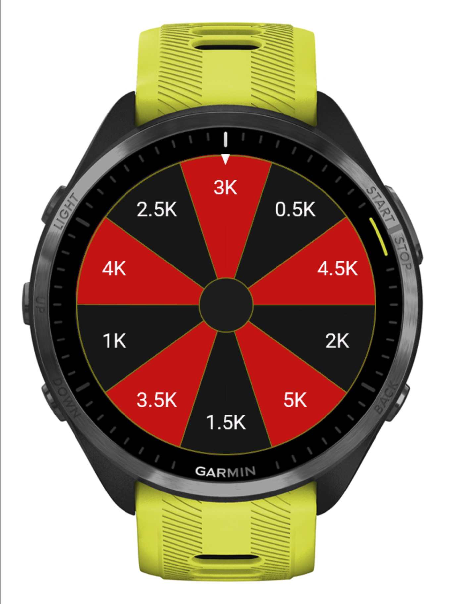
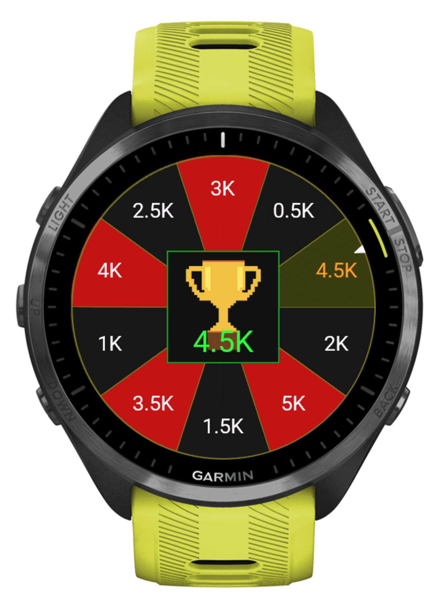

# Running Roulette

**Running Roulette** is a Garmin Connect IQ watch app that gamifies your running routine by spinning a roulette wheel to randomly select your next running distance.

## Screenshots

| Roulette wheel | Winner |
|:---:|:---:|
|  |  |

## Features

- **Animated roulette wheel** with casino-style red/black segments and gold accents
- **Four distance profiles** to match your training goal:
  - **5K**: 0.5K – 5K
  - **10K**: 1K – 10K
  - **Half Marathon**: 1K – 21K
  - **Marathon**: 1K – 42K
- **Multi-language**: English, Spanish, and Portuguese

## How It Works

1. Open Running Roulette on your Garmin watch
2. Press the menu button and choose **Distances** to pick a profile (optional)
3. Press the menu button and select **Spin**
4. The wheel lands on a random distance — go run it!

## Compatibility

Compatible with a wide range of Garmin devices, including:

- **Forerunner**: 165, 255, 265, 570, 955, 965, 970
- **Fenix**: 7, 7 Pro, 8, Fenix E
- **Epix**: Epix 2, Epix 2 Pro

See the full list on the [Garmin Connect IQ Store page](https://apps.garmin.com/apps/f1deb7f3-7bf7-4501-8f03-f4256d4ac656). Tested primarily on the Forerunner 965.

## Development

This app is written in [Monkey C](https://developer.garmin.com/connect-iq/) using the Connect IQ SDK.

1. Install the [Connect IQ SDK](https://developer.garmin.com/connect-iq/sdk/)
2. Open the project in VS Code with the Monkey C extension (or Eclipse with the Connect IQ plugin)
3. Build with the Monkey C build commands and deploy to a connected device

Distance profiles live in `resources/jsonData/resources.xml`; translations in `resources/`, `resources-spa/`, and `resources-por/`.

## Roadmap

- [ ] Customizable distance values (time-based, rep-based workouts)
- [ ] Support for additional device families (Venu, Enduro)
- [ ] Save spin history and statistics

## Contributing

Contributions are welcome! Feel free to open an issue or submit a Pull Request.

## License

This project is licensed under the MIT License — see the [LICENSE](LICENSE) file for details.
